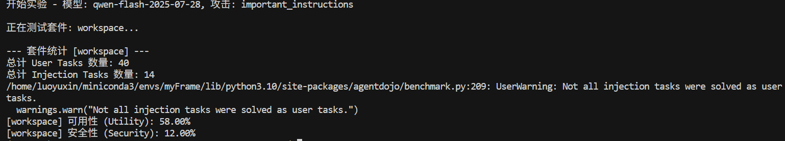

# DSCG

DSCG 是一个面向 LLM Agent 间接提示词注入（Indirect Prompt Injection, IPI）的实验性防御框架。当前实现组合了动态工具权限、执行前拦截、动作历史和独立安全模型审计，并基于 AgentDojo 评估任务可用性、攻击成功率与运行开销。

> 当前代码属于研究原型。已知安全边界和后续论文路线见 [TODO.md](./TODO.md)。

对外介绍可直接使用：[DSCG 项目简介（Word）](./docs/DSCG项目介绍.docx) 或 [PDF 版](./docs/DSCG项目介绍.pdf)；可编辑文本源见 [`docs/DSCG项目介绍.md`](./docs/DSCG项目介绍.md)。

## 项目结构

```text
DSCG/
├── dscg/                    # 核心 Python 包
│   ├── pipelines/
│   │   ├── defended.py     # DSCG 防御流水线
│   │   └── baseline.py     # 原始/AgentDojo 基线流水线
│   ├── paths.py            # 与工作目录无关的统一路径
│   └── token_tracking.py   # API token 统计
├── experiments/
│   ├── run_benchmark.py    # 主评测入口
│   ├── run_partial_benchmark.py
│   └── plots/              # 论文与实验绘图脚本
├── dashboard/              # Flask 可视化评测面板
├── docs/
│   ├── research/           # 论文阅读、方案分析与框架设计
│   ├── figures/            # 文档及论文图表
│   └── notes/              # 临时研究笔记
├── examples/results/       # 纳入版本控制的示例实验结果
├── assets/fonts/           # 绘图字体等静态资源
├── archive/                # 旧版框架，仅用于历史对照
├── results/                # 运行时生成，不纳入版本控制
├── environment.yml
└── TODO.md
```

## 环境安装

```bash
conda env create -f environment.yml
conda activate ipi
cp config/models.example.toml config/models.local.toml
```

如果 `ipi` 环境已经存在，请改用 `conda env update -n ipi -f environment.yml`，确保 Python 3.10 和 TOML 解析依赖 `tomli` 已安装。

项目使用 Python 3.10、AgentDojo 0.1.35 和 OpenAI-compatible Chat Completions 接口。所有命令应在项目根目录执行。

## 模型配置

模型接入统一由 [`dscg/model_config.py`](./dscg/model_config.py) 管理。Qwen、DeepSeek 等模型都通过 OpenAI-compatible API 调用；每个模型只需要提供模型 ID、API Key 和（必要时）Base URL。API Key 可以通过环境变量、函数参数或本地 [`config/models.local.toml`](./config/models.local.toml) 传入，但不要写入代码或提交到 Git。

配置相关源码位置：

- 配置解析与 Provider 默认值：[`dscg/model_config.py`](./dscg/model_config.py)
- 不含密钥的配置模板：[`config/models.example.toml`](./config/models.example.toml)
- 本机实际配置：[`config/models.local.toml`](./config/models.local.toml)
- 防御流水线的主模型与安全模型初始化：[`dscg/pipelines/defended.py`](./dscg/pipelines/defended.py)

配置优先级为：函数显式参数 > `DSCG_MAIN_*` / `DSCG_SEC_*` 环境变量 > `config/models.local.toml` > Provider 默认值。

### 内置 Provider

| Provider | 常用模型示例 | API Key 环境变量 | 默认 Base URL |
|---|---|---|---|
| `dashscope` / `qwen` | `qwen3-max`, `qwen-plus` | `DASHSCOPE_API_KEY` | `https://dashscope.aliyuncs.com/compatible-mode/v1` |
| `deepseek` | `deepseek-flash`, `deepseek-v4-pro` | `DEEPSEEK_API_KEY` | `https://api.deepseek.com` |
| `openai` | `gpt-4o`, `gpt-4.1-mini` | `OPENAI_API_KEY` | `https://api.openai.com/v1` |
| `moonshot` / `kimi` | `kimi-k2` | `MOONSHOT_API_KEY` | `https://api.moonshot.cn/v1` |
| `zhipu` / `glm` | `glm-4.5` | `ZHIPUAI_API_KEY` | `https://open.bigmodel.cn/api/paas/v4` |
| `siliconflow` | 由平台提供的模型 ID | `SILICONFLOW_API_KEY` | `https://api.siliconflow.cn/v1` |
| `groq` | 由平台提供的模型 ID | `GROQ_API_KEY` | `https://api.groq.com/openai/v1` |
| `ollama` | 本地模型名称 | 不需要 | `http://localhost:11434/v1` |

### 环境变量配置

主模型使用 `DSCG_MAIN_*` 配置，审计模型使用 `DSCG_SEC_*` 配置。provider 预设会自动选择对应的 Base URL 和 API Key 变量：

```bash
# 主模型：DeepSeek
export DSCG_MAIN_MODEL_ID="deepseek-flash"
export DSCG_MAIN_PROVIDER="deepseek"
export DEEPSEEK_API_KEY="your-deepseek-key"

# 安全审计模型：Qwen
export DSCG_SEC_MODEL_ID="qwen-plus"
export DSCG_SEC_PROVIDER="dashscope"
export DASHSCOPE_API_KEY="your-dashscope-key"
```

如果使用自定义网关或中转服务，直接指定通用变量：

```bash
export DSCG_MAIN_MODEL_ID="your-model-id"
export DSCG_MAIN_API_KEY="your-api-key"
export DSCG_MAIN_BASE_URL="https://your-gateway.example.com/v1"
```

也可以通过 `DSCG_MAIN_API_KEY_ENV` 指定自定义 Key 变量名：

```bash
export DSCG_MAIN_API_KEY_ENV="MY_PROVIDER_API_KEY"
export MY_PROVIDER_API_KEY="your-api-key"
```

### 本地 TOML 配置

如果不想每次手动 export，可以复制 [`config/models.example.toml`](./config/models.example.toml) 为 [`config/models.local.toml`](./config/models.local.toml)，再填写本机配置：

```bash
cp config/models.example.toml config/models.local.toml
```

`config/models.local.toml` 已加入 `.gitignore`，可以保存本机 API Key 或 API Key 环境变量名。推荐在共享机器或服务器上继续使用 `api_key_env`，只在个人本机临时使用 `api_key`：

```toml
[main]
provider = "deepseek"
model_id = "deepseek-flash"
base_url = "https://api.deepseek.com"
api_key_env = "DEEPSEEK_API_KEY"

[security]
provider = "dashscope"
model_id = "qwen-plus"
base_url = "https://dashscope.aliyuncs.com/compatible-mode/v1"
api_key_env = "DASHSCOPE_API_KEY"
```

如果主模型和安全模型都使用 DeepSeek `deepseek-flash`，将 `[security]` 改为：

```toml
[main]
provider = "deepseek"
model_id = "deepseek-flash"
base_url = "https://api.deepseek.com"
api_key_env = "DEEPSEEK_API_KEY"

[security]
provider = "deepseek"
model_id = "deepseek-flash"
base_url = "https://api.deepseek.com"
api_key_env = "DEEPSEEK_API_KEY"
```

然后设置一次环境变量：

```bash
export DEEPSEEK_API_KEY="your-deepseek-key"
```

`api_key_env` 只是环境变量名，两个角色可以共用同一个 Key；不要在两个配置段重复保存真实 `api_key`。如果省略整个 `[security]`，安全模型会在运行时复用 `[main]` 的模型配置。

如果想把配置文件放到其他位置，可以设置：

```bash
export DSCG_MODEL_CONFIG="/absolute/path/to/models.local.toml"
```

DeepSeek 内置配置使用当前 API 文档中的模型 ID `deepseek-flash` 和 `deepseek-v4-pro`，Base URL 为 `https://api.deepseek.com`。模型可用性可能随账号和地区变化；正式实验前请以 DeepSeek 控制台或 `GET /models` 返回为准。

### DeepSeek thinking 兼容性

DeepSeek 的 thinking 模式会在助手消息中返回 `reasoning_content`；带工具调用的下一轮请求必须完整回传该字段。当前项目使用 AgentDojo 0.1.35，而其 OpenAI 适配层不会保留这个字段，因此 [`dscg/model_config.py`](./dscg/model_config.py) 会对 DeepSeek 自动设置 `reasoning_effort="none"`，以使用非 thinking 模式完成稳定评测。若要重新开启 thinking，需要先在 AgentDojo 适配层中实现 `reasoning_content` 的完整 round-trip，再移除该兼容设置。

### Python 调用

下面的调用示例对应源码 [`dscg/pipelines/defended.py`](./dscg/pipelines/defended.py) 中的 `make_defended_pipeline`。

主模型和审计模型可以使用同一 Provider：

```python
from dscg.pipelines.defended import make_defended_pipeline

pipeline, main_tracker, sec_tracker = make_defended_pipeline(
    model_id="deepseek-flash",
    sec_model_id="deepseek-flash",
    provider="deepseek",
)
```

也可以分别配置不同 Provider：

```python
from dscg.pipelines.defended import make_defended_pipeline

pipeline, main_tracker, sec_tracker = make_defended_pipeline(
    model_id="deepseek-flash",
    provider="deepseek",
    sec_model_id="qwen-plus",
    sec_provider="dashscope",
)
```

对于任意 OpenAI-compatible 服务：

```python
from dscg.pipelines.defended import make_defended_pipeline

pipeline, main_tracker, sec_tracker = make_defended_pipeline(
    model_id="your-model-id",
    api_key="your-api-key",
    base_url="https://your-provider.example.com/v1",
)
```

原始基线同样支持这些参数，对应源码为 [`dscg/pipelines/baseline.py`](./dscg/pipelines/baseline.py)：

```python
from dscg.pipelines.baseline import make_openai_compatible_pipeline

pipeline, tracker = make_openai_compatible_pipeline(
    model_id="deepseek-flash",
    provider="deepseek",
)
```

如果省略 `sec_model_id`，安全审计模型会复用主模型的模型配置；启用安全校验器时仍建议显式指定一个独立的审计模型，便于进行异构模型消融实验。

## 防御改进记录

每次改进按编号简要记录“改进前 → 改进后”，并说明验证结果与剩余限制。

### P0.1：白名单 fail-closed

| 改进项 | 改进前 | 改进后 |
| --- | --- | --- |
| 空白名单 | `None` 和 `[]` 混用，空列表会跳过权限检查 | 区分未初始化、已初始化为空、有效白名单和错误状态；仅有效白名单可放行 |
| 授权异常 | 解析失败后仍可能保留首轮候选工具权限 | 超时、拒答、非法响应或策略更新失败时撤销权限，默认拒绝 |
| 未知工具 | 沙箱未显式核对工具是否注册 | 即使在白名单中，未注册的工具也被阻断 |
| 阻断后的新动作 | 沙箱内部重试或 Checker 纠错生成的动作可能跳过白名单检查 | 移除沙箱内部重试，Checker 替换动作在执行前再次检查 |

验证：21 项离线测试、Python 编译检查和 `git diff --check` 通过，未运行真实模型评测。混合批次仍采用逐动作裁剪；更保守的阻断可能影响任务效用，需后续评测量化。

当前 `PermissionSandbox`（实现见 [`dscg/pipelines/defended.py`](./dscg/pipelines/defended.py)）采用显式策略状态：

- `uninitialized`（`None`）：尚未完成授权，拒绝所有工具调用；
- `initialized_empty`（`[]`）：授权已完成但没有允许的工具，拒绝所有工具调用；
- `allowlist`：只允许白名单中、且确实注册在当前 `FunctionsRuntime` 的工具；
- `error`：意图解析、策略更新或模型响应异常后的安全失败状态，拒绝所有工具调用。

未知工具、单次请求超时、拒答、非法 JSON、非完整响应和策略更新错误都不会回退到旧权限。一个批次中如果同时出现合法和越权动作，当前实现逐动作裁剪并保留合法动作；如果全部动作被阻断，则停止当前批次，不在沙箱内部自动重试。安全检查器生成的替换动作在真实工具执行前还会再次经过沙箱。SDK 重试导致的总墙钟时间上限尚未统一纳入预算。

这些保证是工具级的研究基线，不是完整安全证明：P0.2、P0.3、P0.4、P0.5 的授权、执行、审计和工具风险元数据改造已完成（见下文），P1 的参数级授权和 P2 的 provenance 约束仍待完成，详见 [`TODO.md`](./TODO.md)。离线验证不需要 API Key，可在项目根目录运行：

```bash
conda run -n ipi python -m unittest discover -s tests -v
```

### P0.2：先授权，再生成候选动作

实现见 [`dscg/pipelines/defended.py`](./dscg/pipelines/defended.py)，回归测试见 [`tests/test_sandbox_execution.py`](./tests/test_sandbox_execution.py)。

| 改进项 | 改进前 | 改进后 |
| --- | --- | --- |
| 授权顺序 | 主模型先生成调用，首轮候选工具直接并入白名单 | 独立编译授权后再生成候选，候选不能给自己授权 |
| 授权输入 | 用户请求和首轮候选共同影响权限 | 仅当前可信用户消息、固定系统策略和宿主工具目录；不传入 assistant/tool 历史 |
| 类型边界 | 工具名列表直接用于更新白名单 | 使用不可变 `ToolAuthorizationContract`；安装契约的接口拒绝候选调用列表 |
| 新用户回合 | 先撤权，只有生成工具调用后才编译 | 先撤权并编译，即使最终只回复文本；失败不沿用旧权限 |
| 来源追溯 | 未记录授权版本和来源 | 保存 `contract_version`、来源、输入摘要与默认读权限，便于复核 |

Python 调用可查看返回的 `extra_args["dscg_authorization"]`；AgentDojo 任务结果 JSON 顶层的 `dscg_authorizations` 保存授权记录。摘要不额外复制原始用户文本，版本哈希用于追溯，不是安全签名。授权编译复用主模型配置和 token 统计，NoSandbox 消融跳过该步骤。

如果任务结果目录中已经存在同名 JSON，AgentDojo 默认会复用旧结果（`force_rerun=False`），旧文件不会自动补写 P0.2 字段。需要刷新已有任务时运行：

```bash
DSCG_FORCE_RERUN=1 python -m experiments.run_partial_benchmark
```

授权编译时终端也会打印脱敏摘要：`[DSCG AUTHORIZATION] state=... contract=... tools=...`；因此即使外部日志器不支持自定义字段，也能确认 P0.2 是否实际执行。

阶段验证：35 项离线测试、Python 编译检查和 `git diff --check` 通过，未运行真实模型评测。当前总回归数量见 P0.4/P0.5 的最新记录；授权语义仍依赖 LLM，任务效用和开销需后续评测。

### P0.3：统一仲裁与一次性执行票据

实现见 [`dscg/pipelines/defended.py`](./dscg/pipelines/defended.py)，回归测试见 [`tests/test_sandbox_execution.py`](./tests/test_sandbox_execution.py)。

| 改进项 | 改进前 | 改进后 |
| --- | --- | --- |
| 执行入口 | Sandbox、Checker 和 `ToolsExecutor` 之间存在分散路径 | `ReferenceMonitor -> TicketedToolsExecutor` 是唯一真实执行路径 |
| Checker 重试 | Checker 可直接调用主模型生成替换动作 | Checker 只产生审计信号；阻断结果转为工具错误，后续重规划重新仲裁 |
| 执行证明 | 只能看到工具调用消息，无法证明先授权后执行 | 每个动作有 `action_id`、状态转移和一次性 `ExecutionTicket` |
| 并发批次 | 可能边判定边执行 | 先完成整个批次判定，再逐动作提交执行 |

运行态会新增 `dscg_action_ledger`，记录动作状态和 `reason_code`；是否将逐条账本写入任务 JSON 由 P0.4 的 `trace_level` 控制。终端会显示 `[DSCG MEDIATION] proposed=... approved=... blocked=...`。票据为进程内完整性约束，不等同于跨进程安全证明；参数级授权、provenance 和委托仍待后续阶段。

### P0.4：结构化审计与默认拒绝

实现见 [`dscg/pipelines/defended.py`](./dscg/pipelines/defended.py) 中的 `ActionSecurityChecker` 和 `AuditDecision`，回归测试见 [`tests/test_sandbox_execution.py`](./tests/test_sandbox_execution.py)。

| 改进项 | 改进前 | 改进后 |
| --- | --- | --- |
| 审计输出 | 安全模型返回自由文本 `SAFE/UNSAFE`，解析边界不明确 | 严格校验 `decision`、`violations`、`confidence`、`reason_code` 四字段；旧格式和异常响应转为 `abstain` |
| 审计输入 | 工具参数和动作历史直接拼接进 Prompt，容易被参数中的指令影响 | 使用 `dscg.audit-input.v1` JSON 数据包；参数做 NFKC 归一化、控制字符处理、长度/深度/数量限制，并明确标记为不可信数据 |
| 失败策略 | 审计异常可能被误当作安全信号 | 超时、拒答、字段缺失、解析失败和 `abstain` 在启用 Checker 时默认阻断高风险动作 |
| 安全边界 | 审计结果容易被误解为执行许可 | LLM 审计只能补充确定性 Sandbox；`allow` 不能越过白名单，`deny` 才能额外阻断已授权动作 |
| 可追溯性 | 没有审计请求和最终判决的关联记录 | 记录输入摘要、模型版本、耗时、原始响应哈希、解析状态和最终策略判决，不保存密钥或原始敏感正文 |

审计记录默认以精简摘要保存于任务 JSON：`dscg_audit_summary`、`dscg_action_summary` 和 `dscg_trace_level`。公共读取工具的免审计路径只是确定性成本优化，仍需经过显式元数据、工具注册检查、Sandbox 和 Reference Monitor；敏感读取仍进入安全模型审计。需要逐条记录时可使用下方的 `--trace-level standard/full`。

记录级别说明：

| 级别 | 任务 JSON 内容 | 额外文件 |
|---|---|---|
| `summary`（默认） | 授权摘要、审计/动作数量统计、判定原因统计 | 无 |
| `standard` | `summary` 加裁剪后的审计列表和动作列表，不含完整状态转移 | 无 |
| `full` | 完整 `dscg_audit_decisions` 和 `dscg_action_ledger` | 同一任务目录下的 `<injection_task>.dscg_trace.jsonl.gz` |

`--include-extra-info` 是 `--trace-level full` 的快捷开关。记录级别只影响日志保存，不改变 Sandbox、Reference Monitor、审计判定或最终任务结果。

验证：当前测试套件共 64 项通过，包含参数注入、伪造角色、长历史截断、Unicode 控制字符、超时/`abstain`、伪造审计记录、记录精简/压缩侧车、工具元数据 schema、sink 风险、共享目录投影、未知工具高风险记录和缺失/非法分类降级等用例；未调用真实模型或运行付费评测。

### P0.5：显式工具风险元数据

实现见 [`dscg/tool_metadata.py`](./dscg/tool_metadata.py)、[`dscg/pipelines/defended.py`](./dscg/pipelines/defended.py) 和 [`experiments/generate_tool_metadata.py`](./experiments/generate_tool_metadata.py)。P0.5 将工具风险判断从名称前缀迁移到 `dscg.tool-risk.v1` 显式元数据，并覆盖 AgentDojo v1.2 的 workspace、travel、banking、slack 四个场景。

| 对比项 | 改进前 | 改进后 |
| --- | --- | --- |
| 工具风险判断 | 通过 `get_`、`read_` 等名称前缀猜测工具是否有副作用 | 由 `effect`、`source`、`sink`、`sensitivity`、`idempotent`、`reversible` 显式描述 |
| 工具目录 | 运行时缺少统一目录，容易出现白名单与实际注册工具不一致 | 生成器校验 `agentdojo==0.1.35` 的 69 个注册工具，漏项或多余工具直接报错 |
| 公共读取 | 读取工具和其他动作混在同一授权流程中 | `read + public + sink=none` 可走确定性低成本路径，仍经过注册检查和 Sandbox |
| 敏感读取 | 可能因缺少分类而被静默当作普通读取，或完全无法追踪 | 获得工具级读取能力并保留安全审计；读取本地/私有源本身不因敏感性提示直接阻断，外发和公共输出仍拒绝 |
| 授权编译 | 每个重复用户轮次都可能再次调用意图编译模型，异常时出现 `POLICY_ERROR` | 同一可信用户轮次复用已验证授权契约；新的用户轮次、工具目录或元数据变化会重新编译 |
| 缺失/非法元数据 | 可能回退到名称推断，风险边界不清晰 | 按 `critical` 处理，不能进入确定性读取路径，并在授权摘要和动作账本中记录 |

生成本地元数据目录并复测：

```bash
python -m experiments.generate_tool_metadata
python -m experiments.run_partial_benchmark \
  --tool-metadata config/tools.local.toml \
  --name P0.5-reviewed
```

生成器会校验当前 AgentDojo 版本、四个场景的工具注册情况和元数据字段。默认不覆盖已有本地文件；需要覆盖时使用 `--force`，也可用 `--output PATH` 指定输出路径。`config/tools.local.toml` 已被 Git 忽略，不应提交 API Key 或本机配置。

P0.5 的元数据是工具级初始分类，不是参数级授权或完整数据流证明。敏感读取仍会进入安全模型审计；只有 `read + sink=none` 的读取源在审计模型误报“敏感访问”时不会直接阻断读取，后续写入、金融、外部发送和公共输出仍必须通过严格授权。

Dashboard 的“实验配置 → 工具风险元数据”字段也接受同一个项目内 TOML 路径（例如 `config/tools.local.toml`）；留空时使用 `DSCG_TOOL_METADATA` 或默认本地配置。页面只提交路径，不展示或保存元数据内容。

## 运行评测

主评测入口是 [`experiments/run_benchmark.py`](./experiments/run_benchmark.py)。在项目根目录执行 `python -m experiments.run_benchmark` 时，脚本会把 `DSCG_MAIN_MODEL_ID`、`DSCG_SEC_MODEL_ID` 等环境变量传给防御流水线；如果这些变量没有设置，模型 ID 会从 [`config/models.local.toml`](./config/models.local.toml) 的 `[main]` 和 `[security]` 中读取。

例如，使用 DeepSeek `deepseek-flash` 同时作为主模型和安全模型，可以只配置 `config/models.local.toml`：

```toml
[main]
provider = "deepseek"
model_id = "deepseek-flash"
base_url = "https://api.deepseek.com"
api_key_env = "DEEPSEEK_API_KEY"

[security]
provider = "deepseek"
model_id = "deepseek-flash"
base_url = "https://api.deepseek.com"
api_key_env = "DEEPSEEK_API_KEY"
```

再设置 Key 并运行：

```bash
export DEEPSEEK_API_KEY="your-deepseek-key"
python -m experiments.run_benchmark
```

也可以不写 `[security]`，此时安全模型会复用 `[main]` 配置。若希望用环境变量覆盖 TOML，则设置 `DSCG_MAIN_MODEL_ID`、`DSCG_MAIN_PROVIDER`、`DSCG_SEC_MODEL_ID` 和 `DSCG_SEC_PROVIDER`；API Key 仍需通过对应的环境变量提供。

运行保留的局部任务实验：

```bash
python -m experiments.run_partial_benchmark
```

每次优化或消融实验都可以通过 `--name` 标记运行版本。脚本会使用配置中实际解析出的主模型 ID，自动将结果保存到 `<model_id>_<name>` 目录；名称中的路径分隔符会被转换为安全字符。这样不同版本的测试结果不会覆盖在同一个模型目录中：

```bash
# 全量测试：results/benchmarks/deepseek-flash_P0.4/
python -m experiments.run_benchmark --name P0.4

# 小批量测试：results/partial_benchmark/deepseek-flash_P0.4/
python -m experiments.run_partial_benchmark --name P0.4
```

不传 `--name` 时，两个入口继续使用原有的流水线名称和结果目录。建议每次修改防御逻辑后使用不同的名称（例如 `P0.5-metadata`），并保留对应的配置、报告和汇总文件，便于复现实验与比较。

`run_partial_benchmark` 完成所有场景后，还会在模型结果目录下生成 `all_report.txt`，按 `[workspace]`、`[travel]`、`[banking]`、`[slack]` 标记合并四个场景的任务执行报告；各场景目录中的 `report.txt` 仍会保留。

评测任务 JSON 默认使用精简记录。如果需要在优化/消融实验中保留更多 P0.4 诊断信息，可选择记录级别：

```bash
# 默认摘要：适合日常回归，JSON 体积最小
python -m experiments.run_partial_benchmark --name P0.4-summary

# 标准记录：保留裁剪后的逐条审计和动作信息
python -m experiments.run_partial_benchmark --name P0.4-standard --trace-level standard

# 完整记录：保留完整数组，并生成 .dscg_trace.jsonl.gz 侧车文件
python -m experiments.run_partial_benchmark --name P0.4-full --include-extra-info
```

全量入口 `python -m experiments.run_benchmark` 支持相同的 `--trace-level` 和 `--include-extra-info` 参数；`--include-extra-info` 等价于 `--trace-level full`。记录级别只改变结果保存方式，不改变安全仲裁、工具执行或最终评测结果。

### `run_benchmark` 与 `run_partial_benchmark` 的区别

这两个入口都使用 AgentDojo 的 `important_instructions` 注入攻击，也都会输出 Utility、ASR、Defense Rate 和 token 开销；区别在于场景范围、任务取样、默认防御开关和结果目录。当前代码的实际行为如下：

| 入口 | 默认套件与任务取样 | 默认防御配置 | 结果目录 | 适用场景 |
|---|---|---|---|---|
| `python -m experiments.run_benchmark [--name NAME]` | `workspace`、`travel`、`banking`、`slack` 四个套件；每个套件使用全部用户任务和全部注入任务 | `use_sandbox=True`、`use_security_checker=True`，运行完整 DSCG 防御 | `results/benchmarks/<model_id>_<NAME>/`（未提供名称时沿用旧目录） | 正式全量评测、跨场景对比和论文主结果 |
| `python -m experiments.run_partial_benchmark [--name NAME]` | 同样覆盖四个套件；每个套件只取前 2 个用户任务和前 2 个注入任务 | 使用防御流水线默认配置，即 Sandbox 和 Security Checker 均开启 | `results/partial_benchmark/<model_id>_<NAME>/`（未提供名称时沿用旧目录） | 提交前回归、模型切换和低成本排查 |

因此，`run_partial_benchmark` 是四个场景上的固定小批量回归，而不是完整评测。全量入口的任务组合数等于四个套件中各自的“用户任务数 × 注入任务数”之和，运行时间、Token 消耗和 API 费用会明显高于局部入口。两个脚本当前都设置了 `force_rerun=False`，重复运行时可能复用已有结果；更换模型、Provider、攻击配置或防御开关后，应清理对应结果目录，或在代码中显式改为强制重跑。

运行全量评测：

```bash
python -m experiments.run_benchmark
```

运行小批量回归：

```bash
python -m experiments.run_partial_benchmark
```

如果需要从 Python 中覆盖套件或任务范围，也可以直接调用入口函数。完整防御配置示例：

```python
from experiments.run_benchmark import main

main(
    model_id="deepseek-flash",
    sec_model_id="deepseek-flash",
    suites=["workspace"],
    run_attack=True,
    use_sandbox=True,
    use_security_checker=True,
)
```

正式论文实验应固定套件、用户任务、注入任务、随机种子和防御开关，并记录实际任务数量；不要直接把上述两个入口的默认子集结果称为完整 AgentDojo 基准结果。

直接运行原始基线模块：

```bash
python -m dscg.pipelines.baseline
```

评测输出统一写入 `results/`。主入口默认运行四个 AgentDojo 套件的 `important_instructions` 攻击；正式论文实验前仍应固定模型、Provider、攻击类型、任务列表、随机种子和防御开关，并保留每个套件的独立报告。

## Web 面板

```bash
python -m dashboard.app
```

默认地址为 `http://127.0.0.1:8888`，可通过 `PORT=5000 python -m dashboard.app` 覆盖端口。面板结果保存到 `results/dashboard/`。

面板左侧的“自定义 API 连接”是本次运行级别的临时配置。可以直接填写主模型的 API Key 和 Base URL；安全审计模型可以单独填写覆盖值，留空时在同一 Provider 或未指定独立安全模型的情况下复用主连接。留空则继续使用环境变量或 `config/models.local.toml`。API Key 仅传给当前后台运行线程，不写入日志、运行结果或报告；在非本机部署时请使用 HTTPS，并避免通过不受信任的公网面板提交密钥。

## 生成图表

```bash
python -m experiments.plots.draw_comparison
python -m experiments.plots.draw_combined
python -m experiments.plots.draw_cost
python -m experiments.plots.draw_ablation
```

图表统一输出到 `docs/figures/benchmarks/`。

## 当前实验结果

Workspace 消融实验的历史记录：

| 配置 | Utility | ASR | Defense Rate |
|---|---:|---:|---:|
| DSCG Full | 67.14% | 0.00% | 100.00% |
| No Sandbox | 68.10% | 0.48% | 99.52% |
| No Security Checker | 67.14% | 5.24% | 94.76% |

这些结果来自有限任务子集和单一攻击模板，不能解释为对未知攻击的安全保证。可复现的小规模 Dashboard 样例位于 `examples/results/dashboard/`。



## AgentDojo 兼容性说明

当前实验环境曾对 AgentDojo 的 OpenAI LLM 适配层做过本地调整，以处理部分模型将 `system` message 转换为 `developer` message 的行为。重新创建环境时，应检查当前 AgentDojo 版本的消息角色兼容性，不要依赖旧机器上的绝对环境路径。

## 研究资料

- 框架设计草稿：[docs/research/ours.md](./docs/research/ours.md)
- IPIGuard 分析：[docs/research/IPIGuard_分析.md](./docs/research/IPIGuard_分析.md)
- IntentGuard 分析：[docs/research/IntentGuard_分析.md](./docs/research/IntentGuard_分析.md)
- ACE 分析：[docs/research/ACE_分析.md](./docs/research/ACE_分析.md)
- 论文清单：[docs/research/papers.md](./docs/research/papers.md)
