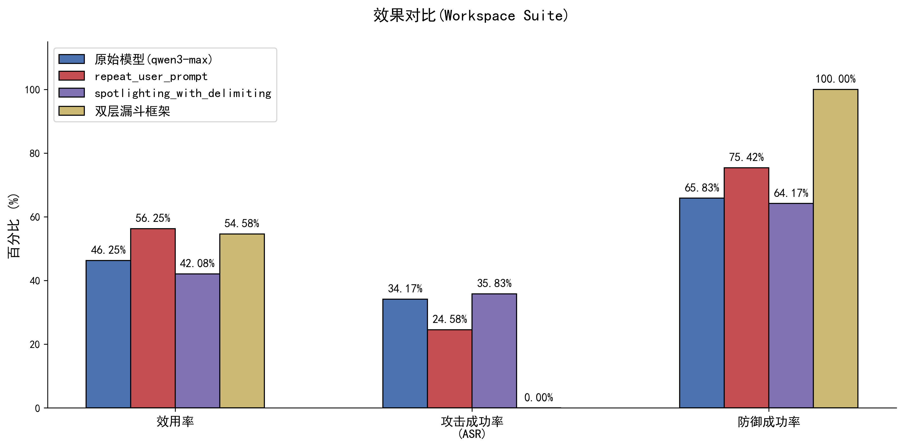

# DSCG 项目简介

## 面向大模型 Agent 间接提示词注入的执行安全框架

### 1. 项目背景与目标

大模型 Agent 可以读取网页、邮件、文件，并调用日历、网盘、消息和金融等工具。问题在于：外部数据本来只是任务材料，却可能包含“忽略原任务、发送数据、删除文件”等隐藏指令，诱导 Agent 执行用户没有授权的操作。这类问题称为间接提示词注入（Indirect Prompt Injection，IPI）。

DSCG（Dynamic Security Capability Guard）是一个面向 IPI 的实验性防御框架。项目关注工具调用的最终执行安全：模型可以提出候选动作，但只有确定性策略层批准后，动作才能真正触发工具副作用。

### 2. 核心思路

DSCG 将 Agent 的“理解任务、提出动作、审计风险、执行工具”拆成不同环节：

1. 根据可信用户请求编译任务级工具授权；
2. 由主模型生成候选工具调用；
3. 由独立安全模型提供多步行为和写操作风险信号；
4. 由 Reference Monitor 统一判定，并为批准动作签发一次性执行票据；
5. 由受控执行器消费票据，动作账本记录批准、执行、失败和阻断状态。

这样可以避免模型同时扮演“动作提出者”和“权限授予者”，也避免安全检查器、重试逻辑或并发路径绕过执行检查。

图 1　DSCG 的 Agent—工具交互流程示意。图中组件名称是框架演进前的概念图，当前实现进一步加入了授权契约、Reference Monitor、执行票据和 ActionLedger。

### 3. 项目优点

- **安全边界清晰**：模型输出被视为候选动作，真实工具执行由策略层和受控执行器决定。
- **覆盖多轮攻击链**：动作账本保存工具调用轨迹，独立审计模型可以结合历史行为发现“先读取、后外发”的组合风险。
- **重试路径可审计**：阻断结果以结构化工具错误反馈，重新生成的动作仍需重新仲裁；一次性票据可以阻止票据重放。
- **便于实验和消融**：支持 Qwen、DeepSeek 等 OpenAI-compatible 模型，基于 AgentDojo 的 workspace、travel、banking、slack 场景评测，并统计效用、攻击成功率、误拒绝、延迟和 Token 成本。
- **具备可视化和复现基础**：项目提供 Flask Dashboard、全量评测和小批量回归入口，结果可保存为 JSON、报告和图表。

### 4. 当前不足

目前框架的主要问题是**设计粒度仍然偏简单，属于研究原型**：

- 授权主要停留在工具名级别，还不能严格约束“给谁发、发什么、访问哪个资源、允许调用几次”等参数；
- 工具风险元数据需要由宿主或本地配置逐项补齐；未分类工具会按高风险处理，完整 AgentDojo 工具目录仍需持续维护；
- 外部数据的来源和流向尚未形成完整 provenance ledger，因此对“敏感数据读取—加工—外发”的约束还不充分；
- 授权编译和语义审计仍依赖模型，可能带来额外 Token、延迟和误拒绝；
- 当前离线测试主要验证执行不变量，完整多模型、多攻击、多随机种子的实验和统计置信区间仍需补充。

图 2　项目评测结果可视化示例。该图用于展示 Dashboard/绘图能力，具体结论需要以固定模型、任务集和完整实验重新验证。

### 5. 研究计划

下一步将把工具级授权扩展到参数级 Task Contract，引入显式工具风险元数据和 provenance 约束，并覆盖用户确认、Agent 委托、MCP/多 Agent 交互以及无工具 IPI。论文实验将与 AgentDojo 原生防御、工具过滤和提示增强方法进行同任务对比，同时报告安全性、任务效用和运行成本。

DSCG 当前适合作为“execution-centric、contract-aware 的 IPI 防御系统”研究原型。它的价值在于提供了一个可运行、可测试、可扩展的执行安全基础；其最终创新性和防御效果仍需要通过更细粒度策略和完整实验进一步证明。
